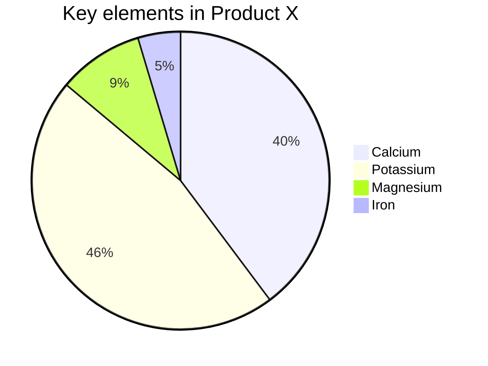

# MD Intelligence 使用介绍

## 语法介绍

### 1. 标题

:::block-1

# 一级标题

## 二级标题

### 三级标题

#### 四级标题

:::

### 2. 列表

:::block-1

- 无序列表 1
- 无序列表 2
  - 无序列表 2.1
  - 无序列表 2.2
:::

:::block-1

1. 有序列表 1
2. 有序列表 2
3. 有序列表 3
:::

### 3. 粗体/斜体/删除线

:::block-1
**这个是粗体**

_这个是斜体_

~~这个是删除线~~

**_这个是粗体加斜体_**

**~~这个是粗体加删除线~~**

**~~_这个是粗体加斜体加删除线_~~**
:::

### 4. 链接

:::block-1
[MD Intelligence功能介绍](https://www.xxx.com)

图片还可以和链接嵌套使用，能够实现推荐卡片的效果，用法如下：

[](https://www.xxx.com)
:::

### 5. 分割线

:::block-1
---
:::

### 6.引用

一级引用如下：

> ### 一级引用示例
>
> 勇者愤怒，抽刃向更强者；怯者愤怒，却抽刃向更弱者。 **——鲁迅**

### 7. 代码块

```java
// FileName: HelloWorld.java
public class HelloWorld {
  // Java 入口程序，程序从此入口
  public static void main(String[] args) {
    System.out.println("Hello,World!"); // 向控制台打印一条语句
  }
}
```

### 8. 公式块

:::block-1
行内公式：$ 1+1=2 $

块公式：

$$
1+1=2
$$

:::

### 9. 容器块

:::block-1
这是容器块1
:::

:::block-2
这是容器块2
:::

:::block-3
这是容器块3
:::

### 9. 提示块

> [!NOTE]
> 突出显示用户应考虑的信息，即使在浏览时也是如此。

> [!TIP]
> 帮助用户取得更大成功的可选信息。

> [!IMPORTANT]
> 用户成功所需的重要信息。

> [!WARNING]
> 由于存在潜在风险，需要用户立即关注的关键内容。

> [!CAUTION]
> 操作的潜在负面后果。

### 10. mermaid图




### 11. 图片

:::block-1


:::

### 12. 表格

:::block-1
| 姓名 | 年龄 | 城市 |
| ------ | ---- | -------- |
| 张三 | 25 | 北京 |
| 李四 | 30 | 上海 |
| 王五 | 28 | 广州 |
:::

## 功能介绍

### 1. AI生成

- 点击右上角`选择AI模型`

  

- 选择模型，配置`apiKey`，并保存


- 编辑区右键，选择`AI生成`


- 使用对应的AI功能，进行生成


### 2. 主题修改

- 点击`主题`菜单栏

- 修改`主题`、`配色`、`背景`、`代码块主题`


### 3. 自动发文

- 点击右上角`发布`按钮
- 如未安装`插件`，则先按照指引安装好插件
- 选择要发布的账号，点击`发布`
  
- 也可点击复制后，进行手动粘贴


### 4. 导出

- 文章支持导出为`markdown`、`html`、`pdf`不同格式。


